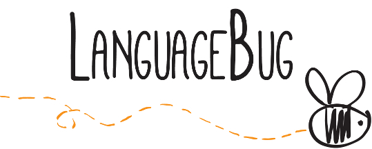

{: style="text-align: center" class="reveal" width="50%"}

      

        <a class="page-link" href="doc.html">Doc</a> 
        /
        <a class="page-link" href="http://languagebug.org">Demo</a> 
        /
        <a class="page-link" href="https://www.youtube.com/watch?v=DGmgGfFZpQo">Expo</a>

        
<strong>Gui Bueno</strong> 

        gob.bueno@gmail.com

         <a class="page-link" href="https://docs.google.com/document/d/1-4_HSx8GIz2UyrEvVgmaTMSE0e34X2Ug28LcIIpGJ2g/edit">CV</a>
        /
        <a class="page-link" href="https://www.youtube.com/watch?v=MjxNSXzIDiM">Mimic</a>
        /
        <a class="page-link" href="https://github.com/guibueno/id-level-easy">Id-PUC</a>

        
<em>Em breve, em português.</em>

      

